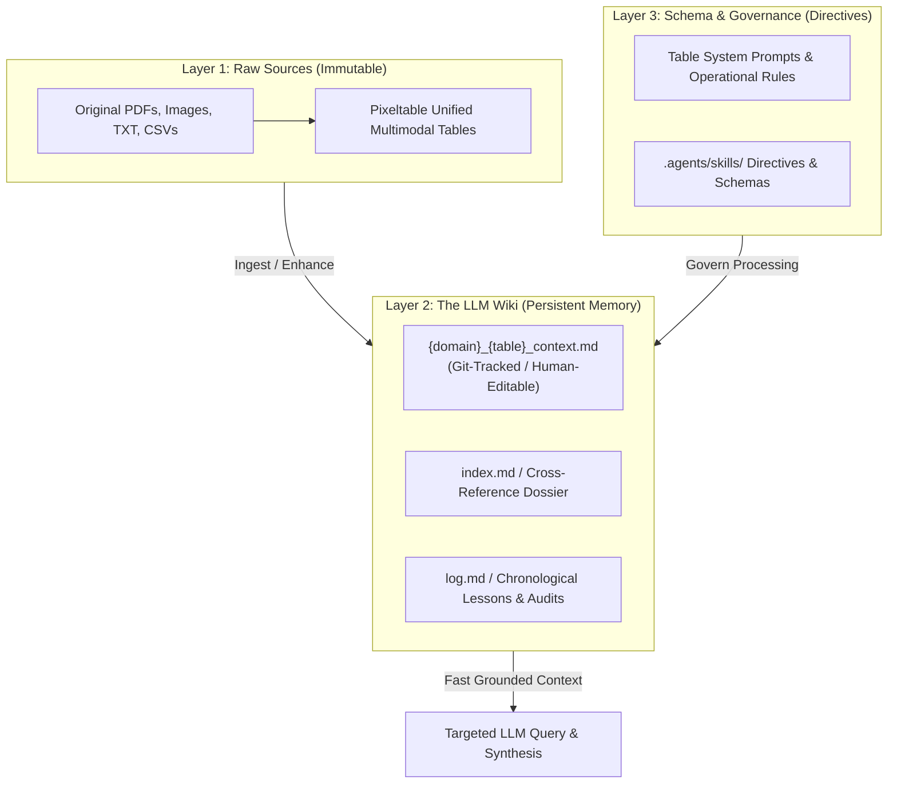
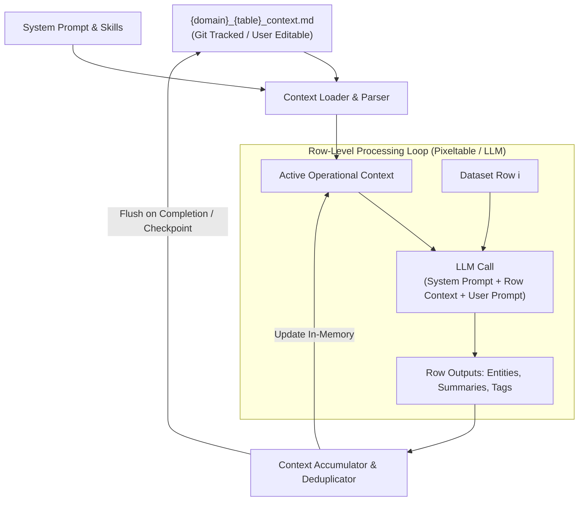

# Feature: Context Processing & Dynamic Memory

- **Feature ID**: `context-processing`
- **Status**: Requirements & Specification (Phase 5)
- **Primary Stakeholder / Use Case**: EBA (Entity Cross-Referencing & Document Indexing), Multi-Row Batch Enhancement, Continuous Pipeline Learning

---

## 1. Overview & Vision

Pipeline Tools processes multimodal datasets across three core operational stages: **Ingestion**, **Enhancement**, and **Export**. In traditional pipelines, each row or batch is evaluated in isolation without memory of what came before. 

**Context Processing** introduces an evolving, persistent memory layer where the workbench continuously **learns from the user and the data** during processing. Rules and training are drawn from the table's system prompt and project skills, while factual discoveries (entities, aliases, document links, data transformations, and lessons learned) accumulate iteratively.

This accumulated memory is stored in a clean, human-readable Markdown file:
```
{domain}_{table}_context.md
```
Because it is plain Markdown, it is tracked in Git, viewable and editable by users at any time, and reloaded on future operations (e.g. enhancing 2,000 new rows) to maintain cumulative intelligence over time.

---

## 2. The LLM Wiki Pattern (Compounding Knowledge Architecture)

### 2.1 The Problem with Ephemeral RAG vs. Compounding Accumulation
Most traditional document workflows rely on standard Retrieval-Augmented Generation (RAG): upload files, retrieve arbitrary chunks at query time, and generate an answer. While functional for simple lookups, this model forces the LLM to **rediscover knowledge from scratch on every query**. There is zero accumulation. A question requiring synthesis across 10 historical documents forces the engine to repeatedly locate, piece together, and re-interpret fragmented excerpts.

**The LLM Wiki shifts the paradigm from ephemeral retrieval to compounding compilation**:
- Instead of re-deriving connections repeatedly, the pipeline progressively builds an **evolving, persistent Markdown wiki** for each domain and table.
- Each domain and table gets its own isolated wiki to learn, accumulate facts, and advise future operations based on its data and user directives.
- When new records arrive, knowledge compounds: entities are cross-referenced, contradictions are flagged, and summaries are updated incrementally.



### 2.2 Tri-Layer Architecture
1. **Layer 1: Raw Sources (Immutable Ground Truth)**:
   - Original files (PDF meeting minutes, contractor proposals, historical audio/video, photos) stored locally and tracked declaratively in Pixeltable tables.
   - Raw sources are read-only and never modified by the LLM.
2. **Layer 2: The Wiki / Persistent Memory (Mutable Markdown)**:
   - Plain Markdown files maintained by the LLM and user: `{domain}_{table}_context.md`, `index.md`, and thematic dossiers.
   - Houses the canonical entity register, aliases, bidirectional links to raw documents (`[Doc Title](file_path)`), global timeline, and lessons learned.
   - Plain Markdown ensures zero vendor lock-in, effortless inspection, and version control via Git.
3. **Layer 3: Schema & Governance (Operational Directives)**:
   - System prompts and `.agents/skills/` that instruct the LLM on wiki maintenance conventions (e.g., citation formatting, canonical naming, conflict resolution, entity classification).

### 2.3 Core Lifecycle Operations
1. **Ingest / Enhance**:
   - As new rows are processed, the LLM extracts key facts, updates entity entries, reconciles aliases (e.g. mapping `"Bob Oppenheimer"` to `"J. Robert Oppenheimer"`), appends source links, and flags factual contradictions with prior records.
2. **Query & Synthesis**:
   - Synthesis operations query the accumulated wiki directly rather than raw chunk vectors, generating comprehensive reports in seconds.
3. **Lint & Reconcile**:
   - Periodic or on-demand health checks to identify orphaned records, unlinked entities, broken file paths, or conflicting assertions across sources.

---

## 3. Core Requirements

### 3.1 Evolving Knowledge & Learning Loop
1. **Continuous Learning**: During batch operations (ingest, enhance, export), the LLM's structured outputs—newly identified entities, objects, locations, summaries, and classifications—are dynamically incorporated into the active context for subsequent rows.
2. **Entity Deduplication & Aliasing**: Maintain a normalized register of entities (people, places, organizations, things) mapping variations and aliases to canonical names (e.g. `"Robert Oppenheimer"`, `"J. R. Oppenheimer"`, `"Oppenheimer"` $\rightarrow$ canonical ID).
3. **Cross-Referencing & Document Indexing (EBA Use Case)**: Every entity maintains bidirectional links to referencing source documents (`[doc_title](file_path)`), enabling index generation and dossier cross-referencing.
4. **Action History & Lessons Learned**: Record pipeline actions applied to the dataset (e.g. schema changes, cleaning operations) and heuristics/lessons learned from edge cases.

### 3.2 Context File Architecture (`{domain}_{table}_context.md`)
The context file must clearly distinguish its structural components using standard Markdown sections:
1. **System Prompt & Governance**: Table-level rules, instructions, and schema definitions.
2. **Active Skills & Tool Directives**: Rules and instructions imported from `.agents/skills/`.
3. **Canonical Entity Register**: Grouped lists of deduplicated entities (People, Places, Organizations, Things) with aliases and referencing document links.
4. **Dataset Summary & Thematic State**: Global semantic overview of the dataset accumulated across rows.
5. **Execution Log & Lessons Learned**: Transformations performed, data quality observations, and operational insights.

### 3.3 User Interaction & Transparency
1. **User Editable**: Users can open, inspect, and edit `{domain}_{table}_context.md` directly in an editor or in the UI at any time. Manual edits are respected and preserved during subsequent processing.
2. **Row-Level Prompting**: At a minimum, every ingestion, enhancement, or export operation pairs a row-level system prompt and user prompt with the active context block.

---

## 4. Architecture & Data Flow



### 4.1 Resolving Stateful Accumulation with Declarative Compute
- **Declarative Pixeltable Integration**: While Pixeltable evaluates `@pxt.udf` functions row-by-row, batch context can be passed either as an explicit context argument or maintained via a stateful accumulator callback executed during batch runs.
- **Checkpointing**: In long-running runs (e.g. 2,000 rows), the context accumulator flushes to `{domain}_{table}_context.md` every $N$ rows (e.g. every 50 rows) to safeguard progress and provide live inspection.

---

## 5. EBA Use Case & Cross-Reference (Index/Xref) Output

The EBA use case requires comprehensive cross-referencing across document archives:
1. **Index Document Generation**: Produce a consolidated `index.md` or `{domain}_{table}_index.md` grouping all discovered entities alphabetically with references:
   ```markdown
   ### Oppenheimer, J. Robert
   - **Aliases**: Robert Oppenheimer, J. R. Oppenheimer
   - **Type**: Person
   - **Referenced In**:
     - [Memo on Laboratory Site (1942)](file:///C:/data/memo_1942.pdf#page=2)
     - [Personnel Directive 14](file:///C:/data/directive_14.txt)
   ```
2. **Reverse Index**: Document dossiers linking to all mentioned entities.
3. **Cross-Reference Navigation**: Enables rapid exploration of complex organizational or investigative archives.

---

## 6. Implementation Plan & Checklist

- [ ] **Phase 1: Minimal Context File Loader & Writer (`context_manager.py`)**
  - [ ] Simple file reader/writer for `{domain}_{table}_context.md` with standard section headers:
    - `## System Prompt & Rules`
    - `## Active Skills`
    - `## Entity Register` (Sectioned by `### People`, `### Places`, `### Organizations`, `### Things` with aliases & `[doc](link)` references)
    - `## Lessons Learned & Notes`
  - [ ] Fast round-trip unit test verifying file read/write.
- [ ] **Phase 2: LLM-Driven Learning & Prompt Integration**
  - [ ] Pass active `{domain}_{table}_context.md` into the row execution prompt so the LLM natively resolves aliases, deduplicates names, and appends new document links.
  - [ ] After batch row processing, append newly discovered entities / notes to `{domain}_{table}_context.md`.
- [ ] **Phase 3: Native Gradio UI & Visual Entity Highlighting**
  - [ ] Add `gr.HighlightedText` in Data Enhancement / Inspector to visualize extracted entities (People, Places, Organizations) with color-coded badges natively from LLM output without custom CSS.
  - [ ] Add collapsible Context Editor drawer (`gr.Code` or `gr.Markdown`) allowing users to inspect and edit `{domain}_{table}_context.md` at any time.
- [ ] **Phase 4: EBA Cross-Reference Index Export**
  - [ ] Add "Export Cross-Reference Index" preset in View & Export that formats the accumulated entity register into a standalone `index.md` dossier with clickable source links.

