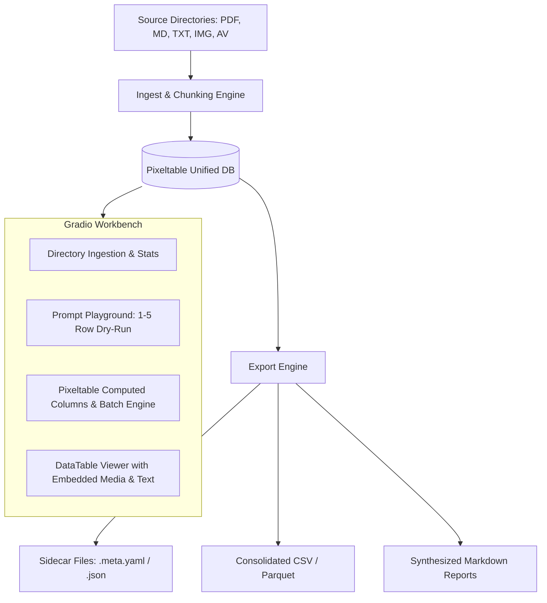

# Pipeline Tools v1.1 Planning & Tracking

Project: Multimodal Asset Processing, Prompt Workbench & Export Engine  
Primary Technologies: **Pixeltable**, **Gradio**, **PyMuPDF / Document Parsers**, **LLM APIs (OpenAI, Anthropic, Gemini, Ollama)**

---

## 1. Project Overview & Architecture

An interactive multimodal workbench and ETL engine designed to:
1. Scan and ingest local directory trees containing multimodal files (PDFs, Markdown, text, images, audio, video).
2. Store documents, metadata, extracted chunks, and lineage in **Pixeltable** unified tables and views.
3. Provide an interactive **Gradio Workbench** to design, test, and iterate on LLM prompts (entity extraction, summarization, metadata generation) on a single row or sample subset before running against full datasets.
4. Export enriched metadata into sidecars (.meta.yaml, .json), tabular datasets (CSV/Parquet), Markdown summaries, and optional YAML frontmatter.

---

## 2. Implementation Roadmap & Task Lists

### Phase 1: Core Foundation & Prompt Playground (Completed & Tested)
- [x] **Environment & Core Config Setup**
  - Dependency setup & config module (`config.json` with Ollama, default models, directories).
  - Minimal automated test suite in `tests/test_app.py` verifying settings, scanner, Pixeltable table creation, and Gradio app loading.
- [x] **Pixeltable Schema & Ingestion Core**
  - Unified table definition (`file_name`, `file_path`, `rel_path`, `modality`, `file_type`, `file_size`, `content`, `doc`, `image`, `audio`, `video`, `metadata`, `created_at`).
  - Domain / directory and table name selection in UI.
  - Ingestion handler: One file → One row, with native text/markdown extraction and direct PDF page text extraction via Pixeltable's bundled `pypdfium2` engine into the `content` column.

- [x] **Prompt Iteration Workbench (Gradio UI)**
  - UI Tab: **Ingestion & Scanner** (directory selector, file filter, scan summary, and Pixeltable ingestion trigger).
  - UI Tab: **Data Enhancement** (select Ollama / Gemini model, enter system/user prompts with `{column}` placeholders, test on 1–N sample rows with side-by-side preview).
  - Column commit workflow: Apply tested prompt across table rows with **Replace** or **Append** modes (and auto-split multi-column JSON outputs).
  - UI Tab: **View & Export** (view table contents, inspect columns, and export prompt-driven Markdown documents).
  - UI Tab: **Settings & Models** (Ollama / Gemini server health test and installed model browser).

### Phase 2: Usability Improvements, Export Engine & Live Monitoring (In Progress)
- [x] **UI Usability & Persistent Inputs**
  - Added dynamic select dropdowns for Domain/Directory and Table names in Data Enhancement tab with automatic auto-refresh when domain changes.
  - Added Live Table Data Preview & Row Count display in Data Enhancement tab (updates automatically on table/domain selection and after batch execution).
  - Fixed table path resolution for preview loading (handles both bare table names `raw_files_test` and domain-prefixed names `eba/raw_files_test` without creating duplicate prefixes).
  - Automatic error formatting and name sanitization (protects against leading digits, dashes, and invalid characters in table/domain names).
  - Saved dialog box last entries (persists last-used domain, table name, model, prompt templates, system prompts, and source directory to `config.json` automatically).
- [x] **Prompt-Driven Markdown Document Export (View & Export Tab)**
  - Integrated export drawer inside the **View & Export** tab with dual mode support:
    1. **LLM Synthesis Report**: Multi-row aggregation via custom prompt template referencing table columns (`{file_name}`, `{visual_summary}`, `{object_tags}`) processed by Ollama or Gemini.
    2. **Direct Template Document**: Formatted Markdown document generated directly from row columns without LLM inference.
  - 4 Task-oriented presets: *Entity & Keyword Intelligence*, *Visual & Scene Breakdown*, *Thematic Summary & Patterns*, and *Direct Structured Catalog*.
  - Visible System Prompt input for clear transparency and instant tuning.
  - Helper pills/tags showing active table columns for easy inclusion in prompts.
  - Automatic file saving to `exports/{domain}_{table}_{timestamp}.md` with real-time UI preview and instant download component.
- [x] **Test Suite Hardening, Isolation & Teardown**
  - Implement isolated test namespaces (`test_suite_isolated`) with reliable `setUpClass`/`tearDownClass` table cleanup.
  - Ensure Windows embedded Postgres locks (`postmaster.pid`) and orphaned sockets are cleanly released on `Ctrl+C` interrupt and normal completion.
  - Add comprehensive edge-case tests (empty directories, unreadable files, corrupt images, missing tables).
- [x] **Embedded Multimodal Media & Interactive Media Inspector**
  - Toggle between fast text-only **⚡ Lightweight Mode** and **🔍 Full Media Mode** across View & Export and Data Enhancement tabs.
  - In Full Mode, table cells render inline HTML thumbnails (``), audio players (`<audio>`), video players (`<video>`), and document badges (`[PDF]`).
  - Selecting any row in the table opens the **🔬 Selected Record Media Inspector** drawer below the table with full-size image, audio, video, extracted text, and metadata.
- [x] **Decouple UI Event Handlers into Testable Controllers**
  - Refactor inner closure handlers in `src/ui/` into pure controller functions (`src/controllers/` or module-level helpers).
  - Enable 100% unit test coverage of UI workflows without requiring Gradio web server initialization.
- [ ] **Automated UI Test Verification & Real-Time Browser Testing Architecture**
  - Design an automated, non-disruptive UI testing and walkthrough verification framework (reassessing Playwright / DevTools MCP integration).
  - Architect real-time visual inspection capabilities vs. headless reporting so test output does not disrupt interactive user workflows.
  - Establish fast, deterministic UI sanity checks across all workbench tabs with automated screenshot capture and DOM assertion hooks.

### Phase 3: Pixeltable Lineage, Controller Decoupling & Dual Export (v1.1 - Complete)
- [x] **Pixeltable Lineage & 1-Click 'Undo Last Operation' Architecture**
  - Instant 1-click **↩️ Undo Last Operation** button on Data Enhancement and View & Export tabs.
  - Automatically reverts newly added LLM columns (dropping auto-split and single columns) and restores baseline schema.
  - Safe 2-step **🗑️ Delete Table** and **⚠️ Delete Domain & All Tables** buttons with confirmation drawers, on-screen status summaries, and detailed logging.
  - Comprehensive unit tests in `tests/test_app.py` verifying column dropping, table dropping, and domain teardown.
- [x] **Decoupled Controller Layer (`src/controllers/`)**
  - Extracted all UI event logic into three pure, testable controllers: `IngestController`, `PlaygroundController`, and `TablesController`.
  - Added 9 dedicated controller test methods in `tests/test_controllers.py` testing validation, scan aggregation, model discovery, and exports without Gradio server overhead.
- [x] **Dual Export Strategies & Per-Row Sidecars (`_meta.md`)**
  - Implemented dual export pipelines in `MarkdownExporter` and `TablesController`:
    - **Single Document Synthesis**: Aggregates multi-row dataset context into one structured Markdown briefing or catalog (`exports/{domain}_{table}_report_{timestamp}.md`).
    - **Per-Row Sidecars**: Executes 1 LLM call per row to produce standalone sidecar documents (`exports/{source_stem}_meta.md`) with clean YAML frontmatter and automatic image embedding (``).
  - Added *Newspaper Story & Embedded Photo* preset with journalist framing.
  - Continuous live row-by-row streaming preview in the UI using Python generators.
  - Added binary media safeguards in `DBManager.ingest_files` to prevent table insertion errors on missing files.
  - **Zero-Memory Database Streaming (`RES-20`)**:
    - Direct in-engine substring projection `table.content.slice(0, 500)` in PostgreSQL eliminating memory spikes on massive text cells (e.g. 108 MB CSV rows in `thinkpad.data_dir2`).
    - Universal cell truncation (`_truncate_cell(val, 250)`) across all table columns and JSON objects, keeping WebSocket payloads under 50 KB.
    - 1 MB text extraction limit during ingestion to safeguard against giant data dumps.
  - **Fast Markdown Sidecar Generation & Media Safety (`RES-21`)**:
    - Path-based image references: pure text metadata and file paths (``) are passed to the LLM; binary media is never uploaded.
    - Markdown-only system prompt enforcement preventing heavy raw HTML/inline SVG generation, reducing sidecar latency from 30+ seconds to 1–2 seconds.
    - Automatic record data context fallback when prompt templates omit explicit placeholders.
  - Verified with 38 unit tests (`38 Passed, 0 Failed, 0 Errors`).

### Phase 4: Multimodal Vision & Entity Classification Engines (Planned)
- [ ] **Hugging Face & YOLO Vision Classification Engines**
  - Integrate Ultralytics YOLO classifiers (e.g., `keremberke/yolov8m-painting-classification`) and Hugging Face vision models alongside Ollama/Gemini.
  - Full 27-class art taxonomy classification as a prompt or classification example:
    `['Abstract_Expressionism', 'Action_painting', 'Analytical_Cubism', 'Art_Nouveau_Modern', 'Baroque', 'Color_Field_Painting', 'Contemporary_Realism', 'Cubism', 'Early_Renaissance', 'Expressionism', 'Fauvism', 'High_Renaissance', 'Impressionism', 'Mannerism_Late_Renaissance', 'Minimalism', 'Naive_Art_Primitivism', 'New_Realism', 'Northern_Renaissance', 'Pointillism', 'Pop_Art', 'Post_Impressionism', 'Realism', 'Rococo', 'Romanticism', 'Symbolism', 'Synthetic_Cubism', 'Ukiyo_e']`
  - Output structured JSON predictions (`painting_style`, `confidence`, `style_probabilities`) with automatic column creation via the Auto-Split engine.
  - Selectable as an AI / Vision engine in Data Enhancement with dry-run sample testing and batch table execution.
- [ ] **GLiNER Zero-Shot Named Entity Recognition (`urchade/gliner`)**
  - Integrate [GLiNER](https://github.com/urchade/GLiNER) (Generalist and Lightweight Model for Named Entity Recognition) as a specialized, ultra-fast data enhancement engine.
  - Enables arbitrary zero-shot entity extraction (e.g. `person`, `organization`, `location`, `date`, `artwork`, `camera_model`, `product`) without prompt engineering or LLM hallucinations.
  - Native integration with Pixeltable via custom User Defined Functions (`@pxt.udf`) or direct Hugging Face transformer pipeline.
  - Automatically unpacks extracted entity categories and text spans into dedicated structured columns via the dynamic auto-split engine.
  - High-throughput batch CPU/GPU inference (~100x faster and cheaper than full LLM generation for entity tagging).
- [ ] **Mobile & Tablet App Support & Cloud Serving**
  - Architecture options for remote mobile/tablet client access to Pipeline Tools.
  - Mitigate embedded PostgreSQL mobile limitation by deploying the Gradio + Pixeltable server to cloud/container hosts with persistent volumes (or remote managed Postgres) while serving a progressive web UI to mobile clients.
  - Cloud deployment options: Hugging Face Spaces with persistent storage, Docker container on AWS/GCP/Fly.io, or desktop LAN host with secure tunnel.
- [ ] **Responsive Mobile & Tablet UI Design**
  - Implement mobile-friendly viewport breakpoints (`@media (max-width: 768px)`).
  - Single-column stacked layouts, touch-friendly tap targets ($\ge 44\text{px}$), and adaptive table views (horizontal scroll cards / compact summary cards) for phone and tablet screens.

### Phase 5: Dynamic Ingestion Context, Skills Integration, Document Reader & Newspaper UX (Planned)
- [ ] **Dynamic Ingestion Context & State Accumulation (`RES-12`)**
  - **Dynamic Cross-Row Memory**: Inject accumulated context into multi-row batch ingestion and prompt pipelines so the system 'learns' as it ingests each row.
  - **Deduplication & Entity Normalization**: Leverage previous row entity spellings, discovered taxonomies, and cross-document relationships to resolve entity ambiguities and maintain uniform naming.
  - **Learned Knowledge Export**: Upon batch completion, write the final accumulated dataset context to `exports/{domain}-{table}-ingestion-context.md` containing global summaries, entity registers, and discovered themes.
  - **Context Structure Standards**: Evaluate structured Markdown knowledge registers, JSON-LD / schema.org triples, and hierarchical memory banks.
  - **Pixeltable Integration**: Leverage Pixeltable table metadata attributes and persistent state views to version and retain learned context alongside dataset lineage.
- [ ] **Project Skills Integration & Prompt `/` Slash Commands (`RES-13`)**
  - **In-Prompt Slash Command Discovery**: Type `/` in prompt input textareas to trigger intelligent auto-completion of skills discovered from `.agents/skills/`.
  - **Dynamic Prompt Decoration**: Automatically parse and inject `SKILL.md` rules, tool definitions, and domain instructions directly into active prompt templates.
  - **Pixeltable Tool Registry**: Map project skills to declarative Pixeltable User Defined Functions (`@pxt.udf`) and tool calling pipelines for seamless row-level evaluation.
- [x] **Document UX & Newspaper / Magazine Layout Engine (`RES-14`)**
  - **Single-Record Document Reader**: Dedicated rich Markdown reader view displaying one record at a time with clean visual styling, custom border colors, header-level collapsible/expandable accordions, styled rollup lists, embedded Mermaid diagrams, interactive charts, and full-resolution media.
  - **Interactive Navigation**: Instant Previous / Next record navigation buttons with hotkeys for rapid qualitative inspection.
  - **Newspaper / Blog Feed View**: Multi-column editorial magazine/newspaper layout organizing dataset rows into interactive story cards, hero image headlines, thematic badges, and executive callouts.
  - **Theme & Layout Selector**: User-selectable visual themes (e.g., *Modern Editorial*, *Technical Dossier*, *Clean Minimal*, *Dark Terminal*) controlling CSS typography, colors, and layout structure.
  - **Dual Export Strategies & Per-Row Sidecars (`_meta.md`)**: Implemented dual export pipelines in `MarkdownExporter` and `TablesController` supporting both unified multi-record synthesis reports and individual per-record Markdown sidecars (`{source_stem}_meta.md`) with automatic media embedding (``), clean YAML frontmatter, and real-time streaming preview updates.
- [ ] **Direct, Visual & Touch-Based Column/Field Selection (`RES-15`)**
  - **Touch-Friendly Visual Selectors**: Replace tedious multi-select field dropdowns with direct visual pill toggles, drag-to-reorder columns, and 1-tap column hide/show icons.
  - **LLM-Assisted Column Referencing**: Automatically detect and highlight active table columns within prompt templates, providing 1-click chip insertion (`{column_name}`).
  - **Pixeltable Projection & Temporary Views**: Utilize Pixeltable's declarative view engine (`pxt.create_view`) and zero-memory column projection filters to render custom visible column subsets on demand without table duplication.
- [ ] **Structured Column Name Prefixes & Visual Schema Grouping (`RES-19`)**
  - **Primary Prefix Convention**:
    - `I_` (or `i_`): **Imported / Source Columns** (e.g. `I_file_name`, `I_file_path`, `I_modality`, `I_file_size`, `I_content`, `I_created_at`, `I_rel_path`). Generated by the directory scanner and file parser during table creation.
    - `C_` (or `c_`): **Calculated / Computed Columns** (e.g. `C_summary`, `C_tags`, `C_entities`, `C_sentiment`, `C_embedding`). Generated automatically by LLM prompt batches (Ollama/Gemini), vision classifiers, or Pixeltable computed expressions / `@pxt.udf`.
    - `U_` (or `u_`): **User / Manual Columns** (e.g. `U_rating`, `U_status`, `U_reviewer_notes`, `U_verified`). Manual labels, flags, or annotations entered directly by humans via table cell edits or form inputs.
  - **Suggestions & Architectural Alternatives**:
    - *Alternative A (Semantic Sub-Prefixes)*: Instead of a single `C_`, subdivide into functional prefixes like `LLM_` (generative text output), `VIS_` (computer vision/YOLO classification), `EMB_` (vector embeddings), and `META_` (system/pipeline metadata).
    - *Alternative B (Case Convention & SQL Portability)*: Because PostgreSQL and Pixeltable sanitize identifiers to lowercase snake_case by default, standardize on lowercase prefixes (`i_`, `c_`, `u_`) in the database engine to avoid SQL quoted-identifier collisions (`"I_file_name"` vs `i_file_name`), while rendering capitalized badges (`[I]`, `[C]`, `[U]`) in the UI.
    - *Alternative C (UI De-Prefixing & Color-Coded Pill Tabs)*: Group table columns visually in the UI into dedicated tabs/filters (📥 *Imported*, ⚡ *Calculated*, ✍️ *User Input*), showing clean display names (`file_name`, `summary`) with distinct color-coded chips.
    - *Alternative D (Smart Template Auto-Aliasing)*: In prompt templates, allow users to type either `{file_name}` or `{i_file_name}` — the prompt executor automatically resolves bare names to their prefixed equivalents.
- [ ] **Live Debug & LLM Activity Console Drawer (`RES-22`, Backlog / Under Consideration)**
  - **Problem & Goal**: To understand and debug the pipeline in real time, users need direct visibility into active prompt contexts, network requests, raw LLM input/output tokens, and database events across Data Enhancement, Export, and Provider setup.
  - **UI Architecture**: A persistent or collapsible bottom drawer / accordion panel (`max-height: 250px; overflow-y: auto`) available across tabs that displays live logging and network activity without obstructing main workbench controls.
  - **Volume & Noise Management**:
    - Filterable log levels / toggles: *LLM Prompts & Responses*, *Network Traffic / HTTP Status*, *Database Operations*, *System Info*.
    - Rotating log file (e.g. `logs/pipeline_activity.log`) paired with an in-memory ring buffer (last 500 lines) to prevent browser memory bloat.
    - 1-click Clear / Copy Log buttons for fast troubleshooting.

    - *Alternative E (Nested Struct vs Flat Columns)*: Evaluate storing raw ingestion metadata in a single nested `source` struct (`source.file_name`, `source.file_path`) versus flat prefixed columns (`i_file_name`). Flat prefixed columns offer superior querying, filtering, and indexing performance in Pixeltable.

### Phase 6: Packaging, Cross-Platform Distribution & Mobile/Tablet Companion (Planned)
- [ ] **Cross-Platform Packaging & Distribution Engine (`RES-16`)**
  - **PyPI / Wheel / CLI Distribution**: Package as an installable Python package via `pip install pipeline-tools` or `uv tool install pipeline-tools` / `uvx pipeline-tools` with a clean CLI entrypoint (`pipeline-tools`).
  - **Standalone Desktop Bundling**: Evaluate PyInstaller, Briefcase, and PyOxidizer to package single-click executable installers (.exe, .dmg, AppImage) bundling Python runtime, Gradio web server, and platform-specific PostgreSQL binaries.
  - **Container Distribution**: Lightweight multi-arch Docker image (`docker run -p 7860:7860 -v ...`) for headless servers, NAS, and container runtimes.
  - **Desktop App Shell (Tauri / Electron)**: Native desktop window wrapping the local Gradio web app with system tray controls, auto-updates, and native file system dialogs.
  - **Embedded PostgreSQL Packaging Challenge**: Address platform-specific binary extraction, file socket locations, and antivirus flags when shipping Pixeltable's embedded `pg_ctl`/`postgres` binaries to non-developer machines.
- [ ] **Remote Hosting, Mobile/Tablet Companion & Local-Connect Architecture (`RES-17`)**
  - **Embedded PostgreSQL Mobile Limitation**: Mobile OSes (iOS / Android) cannot run embedded PostgreSQL natively. Must decouple execution from client display.
  - **Cloud & VPS Hosting Options**: Evaluate containerized deployment on Hugging Face Spaces (Docker + persistent volume), Fly.io, Railway, or VPS instances backed by managed PostgreSQL.
  - **Workstation Local-Connect Pattern ("Antigravity" Style)**:
    - Keep primary compute, local Ollama models, and embedded Pixeltable database running on the user's desktop/workstation.
    - Expose a secure, zero-config peer-to-peer encrypted tunnel (Tailscale Funnel, Cloudflare Zero Trust Tunnel, or Gradio `share=True`).
    - Connect mobile devices and tablets directly to the desktop instance over LAN or WAN.
  - **Mobile as Companion Dashboard & Multimodal Data Source**:
    - **Dashboard / Review**: Responsive touch-optimized reader, media inspector, and export viewer on tablet/phone screens.
    - **Multimodal Ingestion Source**: Use mobile device camera, microphone, and file picker to capture and stream real-world assets (field photos, voice memos, documents) directly into the desktop's Pixeltable repository in real time.

### Phase 7: App Publication, Community Launch & Developer Blog Strategy (`RES-18`)
- [ ] **1. Closed Beta Test User Program**
  - **Cohort Selection**: Recruit 5–10 initial test users (developers, researchers, knowledge workers processing local document/media archives).
  - **Onboarding Guide & Friction Log**: Provide a clean 1-command startup workflow (`uv run gradio app.py` or standalone runner), curated sample datasets (mixed PDFs, images, Markdown), and a structured friction log.
  - **Telemetry & Feedback Triage**: Gather qualitative UX feedback on the workbench workflow (Ingestion -> Data Enhancement -> View & Export) and stress-test performance across diverse hardware/OS environments (macOS M-series, Windows, Linux).
- [ ] **2. PyPI Packaging & Distribution (`pip install pipeline-tools`)**
  - **Package Metadata & Build Config**: Configure `pyproject.toml` with standard PEP 517/621 build tools (Hatchling or Flit), proper project URLs, keywords, classifiers (`Framework :: Gradio`), and CLI entrypoints (`pipeline-tools = "app:main"`).
  - **Dependency Isolation & Stability**: Adhere to `managing-python-dependencies` rules — ensure core dependencies are bounded, development tools are isolated into optional extras, and installation works seamlessly via `pip` and modern `uv tool install` / `uvx pipeline-tools`.
  - **Clean Environment Verification**: Smoke test package installations in isolated virtual environments on Windows, Linux, and macOS to verify embedded PostgreSQL binaries and native C/Rust dependencies initialize without compilation errors.
- [ ] **3. Developer Blog Technical Deep-Dive (Primary Anchor)**
  - **Core Article**: In-depth architectural case study published on the developer blog: *"Building a Local-First Multimodal AI Workbench: Why I Paired Pixeltable with Gradio"*.
  - **Narrative Arc & Structure**:
    - *The Problem*: Fragmented multimodal ETL across messy folders, ad-hoc Python scripts, and heavyweight cloud vector DBs.
    - *Declarative Data Engine*: Why Pixeltable replaces custom chunking/lineage code with unified declarative multimodal tables and persistent embedded PostgreSQL.
    - *Gradio 6.0 UI Architecture*: Decoupling controllers (`src/controllers/`) to eliminate Svelte WebSocket re-render loops; zero-memory media streaming via `/gradio_api/file=`.
    - *War Stories & Technical Lessons*: Windows embedded Postgres PID lock contention, dynamic auto-split schema inference from LLM JSON, and 1-click lineage rollbacks.
    - *Local Privacy & Multi-Provider Routing*: Local zero-cost inference with Ollama alongside cloud scaling with Gemini.
- [ ] **4. Hacker News Launch ("Show HN")**
  - **Submission Title**: `Show HN: Pipeline Tools – Local-first multimodal AI workbench (Pixeltable + Gradio + Ollama)`
  - **Show HN Post**: Origin story, concise architecture summary, link to GitHub repository, live interactive demo / screen capture, and explanation of the declarative multimodal ETL paradigm.
  - **Technical Discussion**: Actively engage in comments addressing data privacy, embedded database mechanics, and how declarative table lineage compares to traditional LangChain / LlamaIndex pipelines.
- [ ] **5. X / Twitter Announcement Thread**
  - **Multimedia Demos**: Fast-paced 15–30s screen recording showing:
    1. Ingesting a mixed folder of documents and images in 1 click.
    2. Prompt iteration on sample rows with dynamic `{column}` placeholders.
    3. Auto-splitting LLM structured JSON output into new database columns with 1-click Undo.
    4. Generating synthesized Markdown dossiers and per-row sidecars (`_meta.md`) with embedded photos.
  - **Community Tagging**: Tag `@Gradio`, `@Pixeltable`, and `@Ollama` teams; link back to the developer blog post, GitHub repository, and quickstart guide.

---

## 3. Issues & Research Items

| ID | Topic | Status | Description / Decision |
|---|---|---|---|
| RES-01 | Pixeltable Chunking vs Table Structure | Complete | Use unified table with text/media columns, chunk views for document-level splitting, and computed columns for LLM calls. |
| RES-02 | Windows PostgreSQL Locking & Concurrency | Complete | Muted noisy logs; registered SIGINT/atexit hooks to clean up sockets and prevent orphaned postmaster.pid lock contention. |
| RES-03 | Model Discovery Timeout | Complete | Reduced Ollama timeout to 2s; added Gemini client for cloud model discovery and multi-provider routing. |
| RES-04 | JSON Auto-Splitting in Table Insertion | Complete | Extract JSON payloads across markdown fences/raw brackets and dynamically create Pixeltable columns via infer_pixeltable_type. |
| RES-05 | UI Layout & CSS Stability | Complete | Enforced max-width 95% and tabitem full-width rules to prevent Gradio tab shifting; updated launch config to Gradio 6.0 standards. |
| RES-06 | Tool Calling & MCP Integration | Open | Single LLM call per row with tool calling support for vision and audio functions. Evaluate MCP integration for efficiency. |
| RES-07 | Playwright vs. Chrome DevTools Testing | Open | Evaluated interactive Chrome DevTools MCP vs headless Playwright for web E2E testing. Deferred Playwright until automated browser regression suite is needed. |
| RES-08 | Hugging Face & YOLO Vision Model Architecture | Open | Planned integration of Hugging Face Hub / Ultralytics vision classifiers (e.g. WikiArt 27-movement classifier) with output auto-splitting into Pixeltable table columns. |
| RES-09 | Mobile / Tablet Architecture & Cloud Serving | Open | Overcome embedded PostgreSQL mobile restriction by hosting Gradio + Pixeltable on cloud containers / remote server with persistent volume, serving responsive PWA to mobile devices. |
| RES-10 | Responsive Mobile / Tablet Design | Open | Adapt Gradio layout with mobile CSS breakpoints, stacked columns, touch-friendly button targets (>=44px), and compact card table views. |
| RES-11 | Pixeltable Lineage & Simple 'Undo' Architecture | Open | Define mutating operation versioning in Pixeltable, design 1-click 'Undo Last Operation' button (column drop / version rollback), and table revision timeline. |
| RES-12 | Dynamic Ingestion Context & State Accumulation | Open | Stateful cross-row context accumulator during batch ingestion to enable entity deduplication and synthetic knowledge export (`domain-table-ingestion-context.md`). |
| RES-13 | Project Skills Integration & Prompt `/` Commands | Open | Dynamic discovery of `.agents/skills/` definitions triggered by `/` prompt slash commands with automatic instruction injection and Pixeltable UDF mapping. |
| RES-14 | Document UX & Newspaper / Magazine Layouts | Open | Single-record rich Markdown reader with collapsible sections, theme selectors, embedded media/Mermaid, and editorial newspaper-style multi-record feeds. |
| RES-15 | Visual Touch-Based Column Selection & Views | Open | Direct visual pill column toggling, LLM-assisted prompt chip insertion, and Pixeltable declarative filtered view projections. |
| RES-16 | Cross-Platform Packaging & Distribution (Pip / Standalone / uvx) | Open | Evaluate PyPI/`uv tool`, PyInstaller desktop standalone, Docker containerization, and Tauri wrapper to bundle Python + embedded PostgreSQL cleanly across OSes. |
| RES-17 | Remote Hosting, Mobile/Tablet Companion & Local-Connect Tunnel | Open | Overcome embedded PostgreSQL mobile limitation via Antigravity-style desktop local-connect (Tailscale / Cloudflare Tunnel / Gradio Share); tablet/phone acts as review dashboard and direct camera/media ingestion source. |
| RES-18 | App Publication, Community Launch & Developer Blog Strategy | Open | Multi-channel launch plan: closed beta test user cohort, PyPI/`pip` packaging with `uvx` support, Show HN submission, X/Twitter demo thread, and comprehensive technical deep-dive blog post. |
| RES-19 | Column Name Prefixes & Visual Schema Grouping | Open | Standardize on column prefixes (I_ imported, C_ calculated/LLM, U_ user input) with UI badge tabs, case sensitivity handling, and template placeholder auto-aliasing. |
| RES-20 | Zero-Memory Table Streaming & OOM Safeguards | Complete | In-engine database substring slicing `table.content.slice(0, 500)` in PostgreSQL, universal 250-char cell truncation, and 1 MB ingestion file read limits to prevent RAM exhaustion. |
| RES-21 | Fast Markdown Sidecar Architecture & Media Safety | Complete | Path-based image references (no binary media uploads to LLMs), strict Markdown system prompt enforcement preventing 4K-token HTML/SVG generation, and automatic record context fallback. |
| RES-22 | Live Debug & LLM Activity Console Drawer | Backlog | Bottom collapsible accordion / slide-up drawer streaming real-time pipeline activity, LLM prompt/response payloads, network calls, and rotating file logs with volume controls. |

