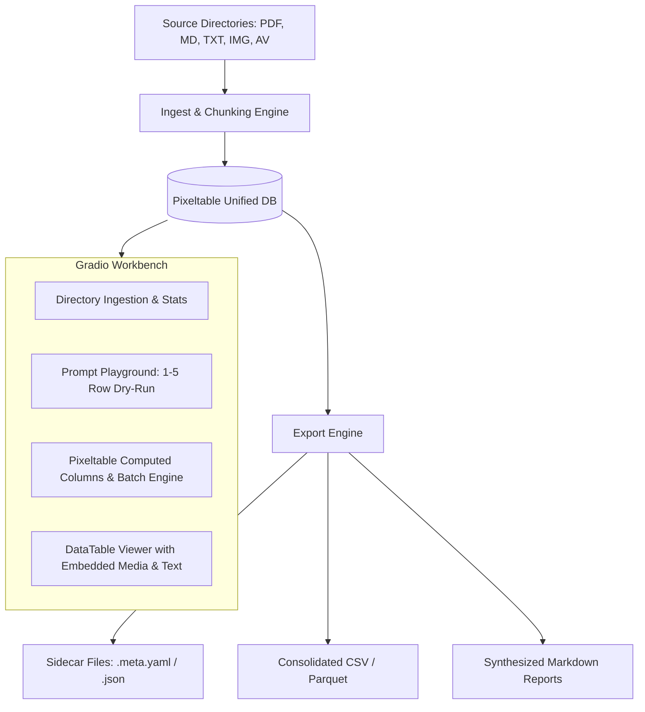

# Pipeline Tools Planning & Tracking

Project: Multimodal Asset Processing, Prompt Workbench & Export Engine  
Primary Technologies: **Pixeltable**, **Gradio**, **PyMuPDF / Document Parsers**, **LLM APIs (OpenAI, Anthropic, Gemini, Ollama)**

---

## 1. Project Overview & Architecture

An interactive multimodal workbench and ETL engine designed to:
1. Scan and ingest local directory trees containing multimodal files (PDFs, Markdown, text, images, audio, video).
2. Store documents, metadata, extracted chunks, and lineage in **Pixeltable** unified tables and views.
3. Provide an interactive **Gradio Workbench** to design, test, and iterate on LLM prompts (entity extraction, summarization, metadata generation) on a single row or sample subset before running against full datasets.
4. Export enriched metadata into sidecars (.meta.yaml, .json), tabular datasets (CSV/Parquet), Markdown summaries, and optional YAML frontmatter.

---

## 2. Implementation Roadmap & Task Lists

### Phase 1: Core Foundation & Prompt Playground (Completed & Tested)
- [x] **Environment & Core Config Setup**
  - Dependency setup & config module (`config.json` with Ollama, default models, directories).
  - Minimal automated test suite in `tests/test_app.py` verifying settings, scanner, Pixeltable table creation, and Gradio app loading.
- [x] **Pixeltable Schema & Ingestion Core**
  - Unified table definition (`file_name`, `file_path`, `rel_path`, `modality`, `file_type`, `file_size`, `content`, `doc`, `image`, `audio`, `video`, `metadata`, `created_at`).
  - Domain / directory and table name selection in UI.
  - Ingestion handler: One file → One row, with native text/markdown extraction and direct PDF page text extraction via Pixeltable's bundled `pypdfium2` engine into the `content` column.

- [x] **Prompt Iteration Workbench (Gradio UI)**
  - UI Tab: **Ingestion & Scanner** (directory selector, file filter, scan summary, and Pixeltable ingestion trigger).
  - UI Tab: **Data Enhancement** (select Ollama / Gemini model, enter system/user prompts with `{column}` placeholders, test on 1–N sample rows with side-by-side preview).
  - Column commit workflow: Apply tested prompt across table rows with **Replace** or **Append** modes (and auto-split multi-column JSON outputs).
  - UI Tab: **View & Export** (view table contents, inspect columns, and export prompt-driven Markdown documents).
  - UI Tab: **Settings & Models** (Ollama / Gemini server health test and installed model browser).

### Phase 2: Usability Improvements, Export Engine & Live Monitoring (In Progress)
- [x] **UI Usability & Persistent Inputs**
  - Added dynamic select dropdowns for Domain/Directory and Table names in Data Enhancement tab with automatic auto-refresh when domain changes.
  - Added Live Table Data Preview & Row Count display in Data Enhancement tab (updates automatically on table/domain selection and after batch execution).
  - Fixed table path resolution for preview loading (handles both bare table names `raw_files_test` and domain-prefixed names `eba/raw_files_test` without creating duplicate prefixes).
  - Automatic error formatting and name sanitization (protects against leading digits, dashes, and invalid characters in table/domain names).
  - Saved dialog box last entries (persists last-used domain, table name, model, prompt templates, system prompts, and source directory to `config.json` automatically).
- [x] **Prompt-Driven Markdown Document Export (View & Export Tab)**
  - Integrated export drawer inside the **View & Export** tab with dual mode support:
    1. **LLM Synthesis Report**: Multi-row aggregation via custom prompt template referencing table columns (`{file_name}`, `{visual_summary}`, `{object_tags}`) processed by Ollama or Gemini.
    2. **Direct Template Document**: Formatted Markdown document generated directly from row columns without LLM inference.
  - 4 Task-oriented presets: *Entity & Keyword Intelligence*, *Visual & Scene Breakdown*, *Thematic Summary & Patterns*, and *Direct Structured Catalog*.
  - Visible System Prompt input for clear transparency and instant tuning.
  - Helper pills/tags showing active table columns for easy inclusion in prompts.
  - Automatic file saving to `exports/{domain}_{table}_{timestamp}.md` with real-time UI preview and instant download component.
- [x] **Test Suite Hardening, Isolation & Teardown**
  - Implement isolated test namespaces (`test_suite_isolated`) with reliable `setUpClass`/`tearDownClass` table cleanup.
  - Ensure Windows embedded Postgres locks (`postmaster.pid`) and orphaned sockets are cleanly released on `Ctrl+C` interrupt and normal completion.
  - Add comprehensive edge-case tests (empty directories, unreadable files, corrupt images, missing tables).
- [x] **Embedded Multimodal Media & Interactive Media Inspector**
  - Toggle between fast text-only **⚡ Lightweight Mode** and **🔍 Full Media Mode** across View & Export and Data Enhancement tabs.
  - In Full Mode, table cells render inline HTML thumbnails (``), audio players (`<audio>`), video players (`<video>`), and document badges (`[PDF]`).
  - Selecting any row in the table opens the **🔬 Selected Record Media Inspector** drawer below the table with full-size image, audio, video, extracted text, and metadata.
- [x] **Decouple UI Event Handlers into Testable Controllers**
  - Refactor inner closure handlers in `src/ui/` into pure controller functions (`src/controllers/` or module-level helpers).
  - Enable 100% unit test coverage of UI workflows without requiring Gradio web server initialization.
- [ ] **Automated UI Test Verification & Real-Time Browser Testing Architecture**
  - Design an automated, non-disruptive UI testing and walkthrough verification framework (reassessing Playwright / DevTools MCP integration).
  - Architect real-time visual inspection capabilities vs. headless reporting so test output does not disrupt interactive user workflows.
  - Establish fast, deterministic UI sanity checks across all workbench tabs with automated screenshot capture and DOM assertion hooks.

### Phase 3: Pixeltable Lineage, Undo & Multimodal Extensions (Planned)
- [x] **Pixeltable Lineage & 1-Click 'Undo Last Operation' Architecture**
  - Instant 1-click **↩️ Undo Last Operation** button on Data Enhancement and View & Export tabs.
  - Automatically reverts newly added LLM columns (dropping auto-split and single columns) and restores baseline schema.
  - Safe 2-step **🗑️ Delete Table** and **⚠️ Delete Domain & All Tables** buttons with confirmation drawers, on-screen status summaries, and detailed logging.
  - Comprehensive unit tests in `tests/test_app.py` verifying column dropping, table dropping, and domain teardown.
- [ ] **Hugging Face & YOLO Vision Classification Engines**
  - Integrate Ultralytics YOLO classifiers (e.g., `keremberke/yolov8m-painting-classification`) and Hugging Face vision models alongside Ollama/Gemini.
  - Full 27-class art taxonomy classification:
    `['Abstract_Expressionism', 'Action_painting', 'Analytical_Cubism', 'Art_Nouveau_Modern', 'Baroque', 'Color_Field_Painting', 'Contemporary_Realism', 'Cubism', 'Early_Renaissance', 'Expressionism', 'Fauvism', 'High_Renaissance', 'Impressionism', 'Mannerism_Late_Renaissance', 'Minimalism', 'Naive_Art_Primitivism', 'New_Realism', 'Northern_Renaissance', 'Pointillism', 'Pop_Art', 'Post_Impressionism', 'Realism', 'Rococo', 'Romanticism', 'Symbolism', 'Synthetic_Cubism', 'Ukiyo_e']`
  - Output structured JSON predictions (`painting_style`, `confidence`, `style_probabilities`) with automatic column creation via the Auto-Split engine.
  - Selectable as an AI / Vision engine in Data Enhancement with dry-run sample testing and batch table execution.
- [ ] **Mobile & Tablet App Support & Cloud Serving**
  - Architecture options for remote mobile/tablet client access to Pipeline Tools.
  - Mitigate embedded PostgreSQL mobile limitation by deploying the Gradio + Pixeltable server to cloud/container hosts with persistent volumes (or remote managed Postgres) while serving a progressive web UI to mobile clients.
  - Cloud deployment options: Hugging Face Spaces with persistent storage, Docker container on AWS/GCP/Fly.io, or desktop LAN host with secure tunnel.
- [ ] **Responsive Mobile & Tablet UI Design**
  - Implement mobile-friendly viewport breakpoints (`@media (max-width: 768px)`).
  - Single-column stacked layouts, touch-friendly tap targets ($\ge 44\text{px}$), and adaptive table views (horizontal scroll cards / compact summary cards) for phone and tablet screens.

### Phase 4: Dynamic Ingestion Context, Skills Integration, Document Reader & Newspaper UX (Planned)
- [ ] **Dynamic Ingestion Context & State Accumulation (`RES-12`)**
  - **Dynamic Cross-Row Memory**: Inject accumulated context into multi-row batch ingestion and prompt pipelines so the system 'learns' as it ingests each row.
  - **Deduplication & Entity Normalization**: Leverage previous row entity spellings, discovered taxonomies, and cross-document relationships to resolve entity ambiguities and maintain uniform naming.
  - **Learned Knowledge Export**: Upon batch completion, write the final accumulated dataset context to `exports/{domain}-{table}-ingestion-context.md` containing global summaries, entity registers, and discovered themes.
  - **Context Structure Standards**: Evaluate structured Markdown knowledge registers, JSON-LD / schema.org triples, and hierarchical memory banks.
  - **Pixeltable Integration**: Leverage Pixeltable table metadata attributes and persistent state views to version and retain learned context alongside dataset lineage.
- [ ] **Project Skills Integration & Prompt `/` Slash Commands (`RES-13`)**
  - **In-Prompt Slash Command Discovery**: Type `/` in prompt input textareas to trigger intelligent auto-completion of skills discovered from `.agents/skills/`.
  - **Dynamic Prompt Decoration**: Automatically parse and inject `SKILL.md` rules, tool definitions, and domain instructions directly into active prompt templates.
  - **Pixeltable Tool Registry**: Map project skills to declarative Pixeltable User Defined Functions (`@pxt.udf`) and tool calling pipelines for seamless row-level evaluation.
- [ ] **Document UX & Newspaper / Magazine Layout Engine (`RES-14`)**
  - **Single-Record Document Reader**: Dedicated rich Markdown reader view displaying one record at a time with clean visual styling, custom border colors, header-level collapsible/expandable accordions, styled rollup lists, embedded Mermaid diagrams, interactive charts, and full-resolution media.
  - **Interactive Navigation**: Instant Previous / Next record navigation buttons with hotkeys for rapid qualitative inspection.
  - **Newspaper / Blog Feed View**: Multi-column editorial magazine/newspaper layout organizing dataset rows into interactive story cards, hero image headlines, thematic badges, and executive callouts.
  - **Theme & Layout Selector**: User-selectable visual themes (e.g., *Modern Editorial*, *Technical Dossier*, *Clean Minimal*, *Dark Terminal*) controlling CSS typography, colors, and layout structure.
  - **Technical Options & Sidecar Export**: Support dual export pipelines—monolithic multi-record Markdown reports and individual per-record Markdown documents with YAML/JSON frontmatter sidecars.
- [ ] **Direct, Visual & Touch-Based Column/Field Selection (`RES-15`)**
  - **Touch-Friendly Visual Selectors**: Replace tedious multi-select field dropdowns with direct visual pill toggles, drag-to-reorder columns, and 1-tap column hide/show icons.
  - **LLM-Assisted Column Referencing**: Automatically detect and highlight active table columns within prompt templates, providing 1-click chip insertion (`{column_name}`).
  - **Pixeltable Projection & Temporary Views**: Utilize Pixeltable's declarative view engine (`pxt.create_view`) and zero-memory column projection filters to render custom visible column subsets on demand without table duplication.

---

## 3. Issues & Research Items

| ID | Topic | Status | Description / Decision |
|---|---|---|---|
| RES-01 | Pixeltable Chunking vs Table Structure | Complete | Use unified table with text/media columns, chunk views for document-level splitting, and computed columns for LLM calls. |
| RES-02 | Windows PostgreSQL Locking & Concurrency | Complete | Muted noisy logs; registered SIGINT/atexit hooks to clean up sockets and prevent orphaned postmaster.pid lock contention. |
| RES-03 | Model Discovery Timeout | Complete | Reduced Ollama timeout to 2s; added Gemini client for cloud model discovery and multi-provider routing. |
| RES-04 | JSON Auto-Splitting in Table Insertion | Complete | Extract JSON payloads across markdown fences/raw brackets and dynamically create Pixeltable columns via infer_pixeltable_type. |
| RES-05 | UI Layout & CSS Stability | Complete | Enforced max-width 95% and tabitem full-width rules to prevent Gradio tab shifting; updated launch config to Gradio 6.0 standards. |
| RES-06 | Tool Calling & MCP Integration | Open | Single LLM call per row with tool calling support for vision and audio functions. Evaluate MCP integration for efficiency. |
| RES-07 | Playwright vs. Chrome DevTools Testing | Open | Evaluated interactive Chrome DevTools MCP vs headless Playwright for web E2E testing. Deferred Playwright until automated browser regression suite is needed. |
| RES-08 | Hugging Face & YOLO Vision Model Architecture | Open | Planned integration of Hugging Face Hub / Ultralytics vision classifiers (e.g. WikiArt 27-movement classifier) with output auto-splitting into Pixeltable table columns. |
| RES-09 | Mobile / Tablet Architecture & Cloud Serving | Open | Overcome embedded PostgreSQL mobile restriction by hosting Gradio + Pixeltable on cloud containers / remote server with persistent volume, serving responsive PWA to mobile devices. |
| RES-10 | Responsive Mobile / Tablet Design | Open | Adapt Gradio layout with mobile CSS breakpoints, stacked columns, touch-friendly button targets (>=44px), and compact card table views. |
| RES-11 | Pixeltable Lineage & Simple 'Undo' Architecture | Open | Define mutating operation versioning in Pixeltable, design 1-click 'Undo Last Operation' button (column drop / version rollback), and table revision timeline. |
| RES-12 | Dynamic Ingestion Context & State Accumulation | Open | Stateful cross-row context accumulator during batch ingestion to enable entity deduplication and synthetic knowledge export (`domain-table-ingestion-context.md`). |
| RES-13 | Project Skills Integration & Prompt `/` Commands | Open | Dynamic discovery of `.agents/skills/` definitions triggered by `/` prompt slash commands with automatic instruction injection and Pixeltable UDF mapping. |
| RES-14 | Document UX & Newspaper / Magazine Layouts | Open | Single-record rich Markdown reader with collapsible sections, theme selectors, embedded media/Mermaid, and editorial newspaper-style multi-record feeds. |
| RES-15 | Visual Touch-Based Column Selection & Views | Open | Direct visual pill column toggling, LLM-assisted prompt chip insertion, and Pixeltable declarative filtered view projections. |
